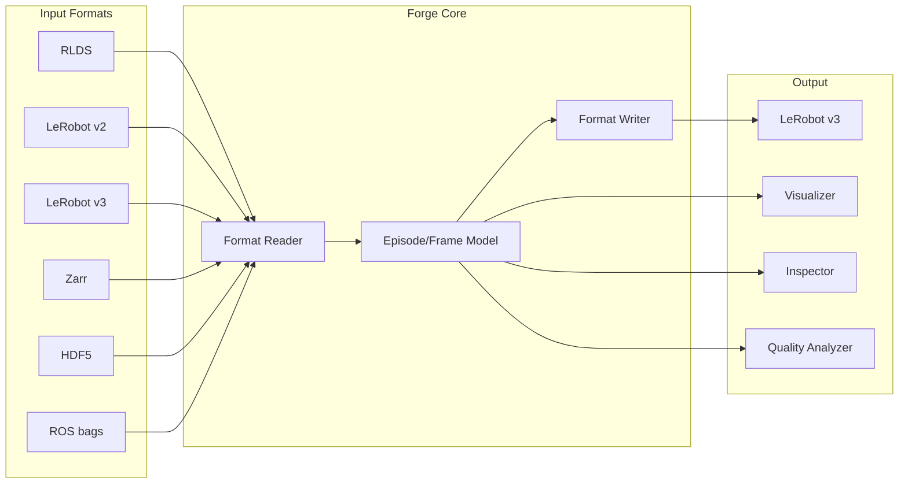
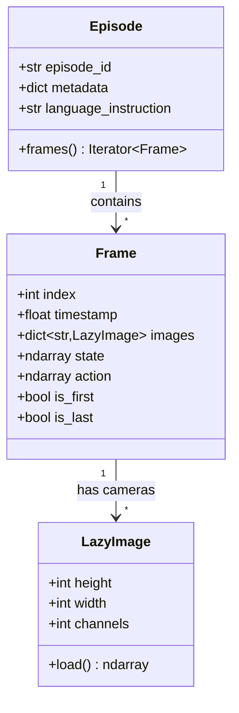
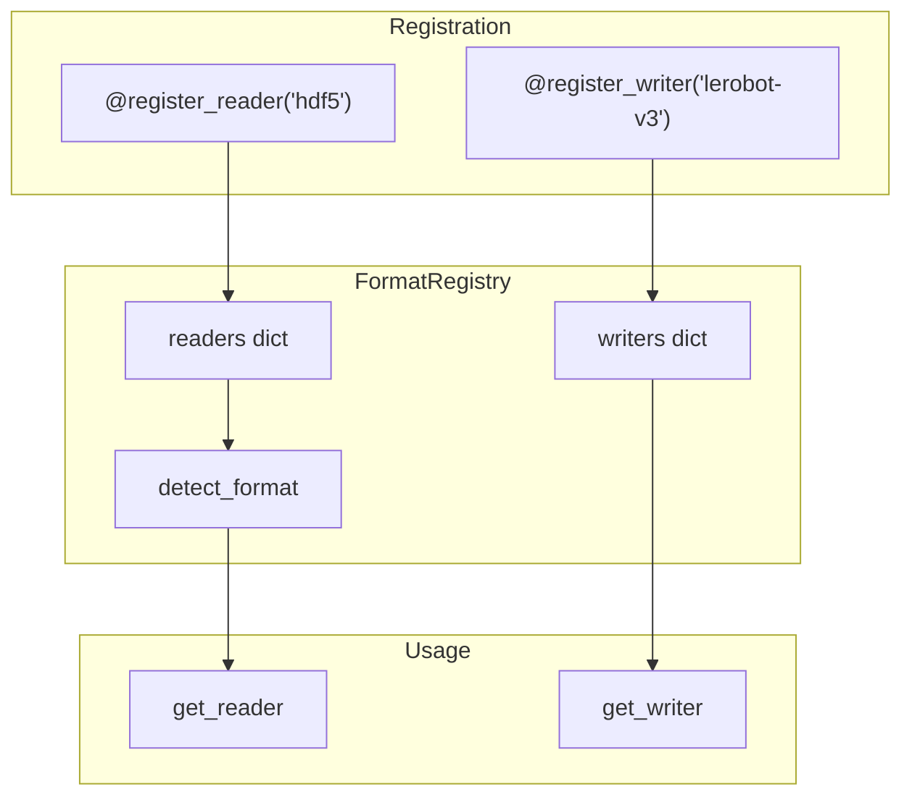
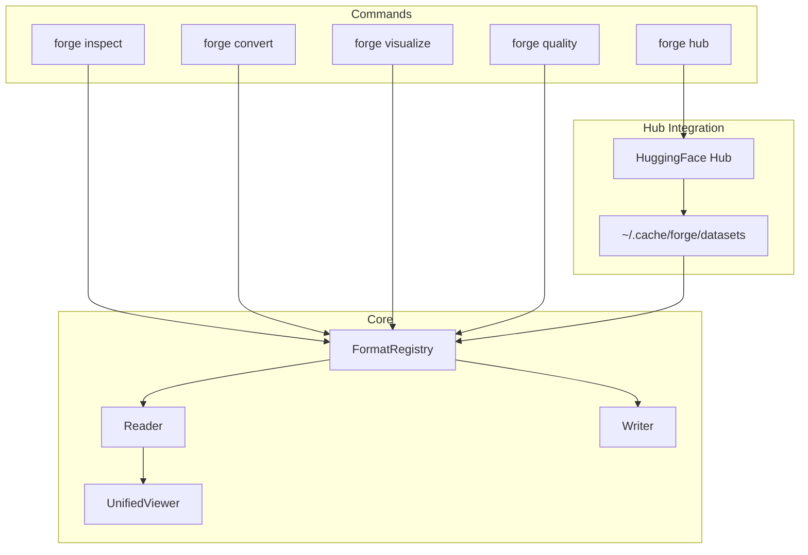
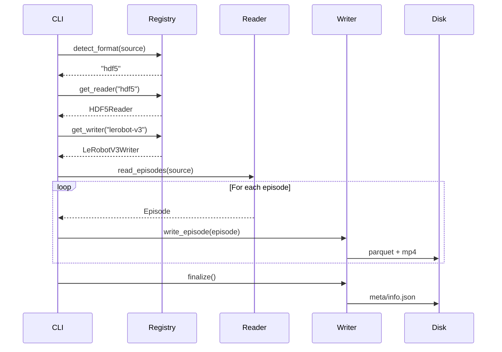

# Forge Architecture

## Overview

Forge is designed around a simple principle: **any format in, any format out**, using a canonical intermediate representation.

## Core Data Flow



## Canonical Data Model

All formats are normalized to this intermediate representation:



## Format Registry

Formats register themselves using decorators:



## CLI Command Flow



## Conversion Pipeline



## Project Structure

```
forge/
├── cli.py                 # CLI commands (inspect, convert, visualize, hub)
├── core/
│   ├── models.py          # Episode, Frame, LazyImage
│   ├── protocols.py       # FormatReader, FormatWriter interfaces
│   └── exceptions.py      # Custom exceptions
├── formats/
│   ├── registry.py        # FormatRegistry
│   ├── rlds/              # RLDS reader
│   ├── lerobot_v2/        # LeRobot v2 reader
│   ├── lerobot_v3/        # LeRobot v3 reader + writer
│   ├── zarr/              # Zarr reader
│   ├── hdf5/              # HDF5 reader (robomimic, ACT/ALOHA)
│   └── rosbag/            # ROS bag reader
├── hub/
│   ├── url.py             # hf:// URL parsing
│   └── download.py        # Dataset downloading
├── convert/
│   └── converter.py       # Conversion orchestration
├── inspect/
│   └── inspector.py       # Dataset inspection
├── quality/
│   ├── config.py          # QualityConfig (thresholds, weights)
│   ├── metrics.py         # Individual metric functions
│   ├── analyzer.py        # QualityAnalyzer orchestrator
│   └── models.py          # EpisodeQuality, QualityReport
└── visualize/
    └── unified_viewer.py  # Format-agnostic viewer
```

## Adding a New Format

1. Create format directory: `forge/formats/myformat/`

2. Implement reader:
```python
@FormatRegistry.register_reader("myformat")
class MyFormatReader:
    @classmethod
    def can_read(cls, path: Path) -> bool:
        # Detection logic
        ...

    def inspect(self, path: Path) -> DatasetInfo:
        # Return dataset metadata
        ...

    def read_episodes(self, path: Path) -> Iterator[Episode]:
        # Yield episodes with lazy frame loading
        ...
```

3. Register in `forge/formats/__init__.py`:
```python
try:
    from forge.formats import myformat
except ImportError:
    pass
```

4. Add to detection priority in `registry.py` if needed

That's it! Your format now works with:
- `forge inspect`
- `forge convert ... --format lerobot-v3`
- `forge visualize`
